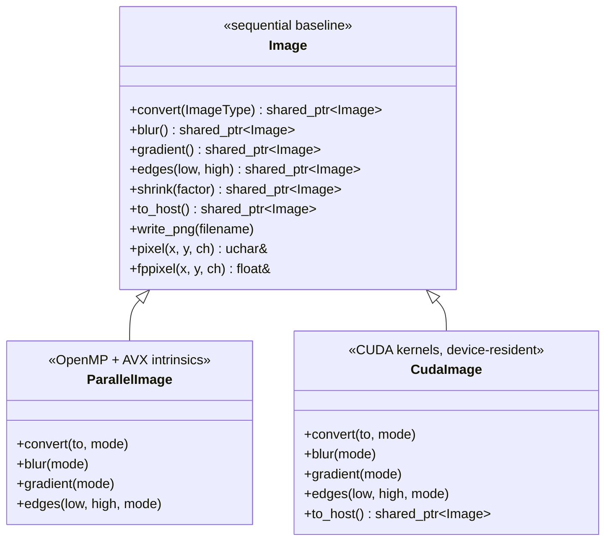

# Parallel Edge Detection

One edge-detection pipeline, three engines. A Canny-style image pipeline — grayscale conversion → 5×5 Gaussian blur → Sobel gradient → dual-threshold hysteresis — implemented as a **sequential C++ baseline**, an **OpenMP + AVX (Intel intrinsics) CPU engine**, and a **CUDA GPU engine**, all behind one virtual interface. The parallel engines are raced against the sequential reference for both **correctness** (the 8-bit outputs must match exactly) and **speed** (a microsecond timing harness built into the test suite).

The interesting part isn't just that it's parallel — it's the built-in **mode system**: each pipeline stage has several numbered implementation variants (naive OpenMP, direct pointer access, single-loop, AVX-vectorized…), so the test binary doubles as a benchmarking lab that shows exactly which optimization bought what.

---

## Table of Contents

1. [The Pipeline](#the-pipeline)
2. [Three Engines, One Interface](#three-engines-one-interface)
3. [Repository Map](#repository-map)
4. [The Mode System — a Built-in Benchmarking Lab](#the-mode-system--a-built-in-benchmarking-lab)
5. [Engine Deep Dives](#engine-deep-dives)
   - [Sequential Baseline](#1-sequential-baseline-image)
   - [OpenMP + AVX](#2-openmp--avx-parallelimage)
   - [CUDA GPU](#3-cuda-gpu-cudaimage)
6. [Correctness Strategy](#correctness-strategy)
7. [Timing Methodology](#timing-methodology)
8. [Building](#building)
9. [Running the Tests](#running-the-tests)
10. [Known Limitations & Sharp Edges](#known-limitations--sharp-edges)
11. [Provenance & Acknowledgments](#provenance--acknowledgments)

---

## The Pipeline

Every engine runs the same five stages. For the 2048×2048 test image, the data sizes at each step:


Stage details (identical math in all three engines):

1. **Convert** — RGB → floating-point grayscale as the *equal-weight* channel mean `(R + G + B) / (255·3)`, mapping into `[0, 1]`.
2. **Blur** — 5×5 Gaussian convolution (weights sum to ≈ 1.0) to suppress noise before differentiation. Borders use clamp-to-edge (the nearest valid pixel is replicated).
3. **Gradient** — horizontal and vertical 3×3 Sobel convolutions, combined as the gradient magnitude `√(Gx² + Gy²)`. Same clamp-to-edge borders.
4. **Edges** — dual-threshold hysteresis: a pixel becomes an edge (1.0) if its gradient exceeds `high`, or if it exceeds `low` *and* a pixel in its 3×3 neighborhood exceeds `high`. Everything else is 0. The tests use `low = 0.3`, `high = 0.7`.
5. **Convert back** — the binary float map is scaled by 255 into an 8-bit grayscale PNG (edges white, background black).

Because every stage returns a `std::shared_ptr<Image>`, the whole pipeline chains in one expression and intermediates free themselves as references drop:

```cpp
auto result = lena.convert(floatgrayscale)->blur()->gradient()->edges(0.3f, 0.7f)->convert(grayscale);
result->write_png("edges.png");
```

## Three Engines, One Interface



| Engine | Where | Parallelism | Memory |
|---|---|---|---|
| `Image` | [image.cpp](image.cpp) | none — plain nested loops, `pixel()`/`fppixel()` accessors | host `malloc` (or STB-owned for loaded files) |
| `ParallelImage` | [parallel_image.hpp](parallel_image.hpp) | `#pragma omp parallel for` (over rows in the stencil stages) + 256-bit AVX intrinsics (8 floats/op) | host `malloc`, raw-pointer access in fast modes |
| `CudaImage` | [cuda_image.cu](cuda_image.cu) | one CUDA thread per pixel, 32×32 blocks | `cudaMalloc` device memory; the *entire* pipeline stays on the GPU |

The polymorphism is the point: the same chained-pipeline expression works on any engine, and the correctness tests exploit it by running identical pipelines through different subclasses and demanding identical bytes out.

For `CudaImage`, chaining means **one host→device upload, N kernels, one device→host download**: each stage's output is a new device-resident `CudaImage`, so nothing round-trips through the CPU until you call `to_host()`.

## Repository Map

```text
ParallelEdgeDetection-main/
├── CMakeLists.txt          # Build: C++20, -fopenmp -mavx, CUDA (arch 75 + 89), GoogleTest via FetchContent
├── image.hpp / image.cpp   # Base Image class: STB-backed load/save, pixel accessors,
│                           #   sequential convert / shrink / blur / gradient / edges
├── parallel_image.hpp      # ParallelImage: all OpenMP + AVX variants (header-only engines)
├── parallel_image.cpp      # to_host() stub — throws if called (see Known Limitations)
├── cuda_image.hpp / .cu    # CudaImage: device memory management + 5 CUDA kernels
├── parallel_utils.{hpp,cpp}# GetTiming (µs lambda timer), CacheNuke cache-flush utilities
├── edgedetect_tests.cpp    # GoogleTest: sequential correctness + OpenMP/AVX mode races
├── user_tests.cpp          # GoogleTest: full CUDA pipeline, per-stage timings, exact-match check
├── main.cpp                # Placeholder stub ("Hello world!") — the test binary is the real driver
├── stb_image.h / stb_image_write.h / stb_instantiation.cpp   # STB image I/O (PNG-only build)
└── testfiles/
    ├── Lena_2048.png       # 2048×2048 RGB test image (ethically sourced recreation)
    └── shrunk.png          # Reference output for the shrink test
```

## The Mode System — a Built-in Benchmarking Lab

Each `ParallelImage` operation takes an optional `mode` argument selecting an implementation variant. The timing tests run the modes back-to-back on the same input and print the microsecond cost of each, so the effect of each optimization step is directly measurable. The no-argument virtual overrides dispatch to the variant that won:

| Operation | Modes | Default | The progression |
|---|---|---|---|
| copy constructor | 0–2 | 2 | plain `memcpy` → parallel-for byte copy → per-thread chunked `memcpy` |
| `convert` | 0–5 | 4 | sequential → naive OpenMP (`fppixel` accessors) → direct src+dst pointers (modes 2 and 3 are identical twins) → **single flat loop over pixels** → single loop, no OpenMP |
| `blur` | 0–4 | 4 | sequential → naive OpenMP → direct pointer access → duplicate of mode 2 (a planned blocked variant, never implemented) → **AVX interior + scalar borders** |
| `gradient` | 0–3 | 3 | sequential → naive OpenMP → direct pointer access → **AVX interior + scalar borders** |
| `edges` | 0–2 | 2 | sequential → naive OpenMP → **direct pointer access** (branchy hysteresis doesn't vectorize cleanly) |

Two honest quirks of the races: `ParallelTest.TimeGradient` only races gradient modes 0–2 — the AVX gradient (mode 3, the default) is never individually timed, though its *correctness* is still verified because `TimeEdge` and `FullPerformance` run it via the default dispatch and compare against the sequential oracle. And two of the "steps" above (convert 2→3, blur 2→3) exist only in the code's comments — the implementations are byte-identical, so any timing difference between them is noise.

Two lessons the mode races encode:

- **Accessor overhead is real.** The jump from `fppixel(x, y)` calls (mode 1) to raw `srcdata[x + y * _x]` indexing (mode 2+) is one of the larger wins — the inline accessor does per-call channel math the optimizer doesn't always hoist.
- **Vectorize the interior, clamp the border.** The AVX modes process 8 pixels per instruction on the region where the stencil can't leave the image, then a second scalar pass (with a `continue` over the already-done interior) handles the clamped border ring. No branches inside the hot loop.

## Engine Deep Dives

### 1. Sequential Baseline (`Image`)

[image.cpp](image.cpp) is the readable reference implementation: nested `x`/`y` loops, bounds-clamped stencil reads through `fppixel()`, one output pixel at a time. It also owns the plumbing every engine inherits:

- **STB-backed I/O** — `Image(filename)` loads any PNG via `stbi_load` (the build defines `STBI_ONLY_PNG`); `write_png()` saves, auto-converting float grayscale to 8-bit first.
- **Two pixel layouts** — integer types (`grayscale`, `rgb`, `rgba`: 1–4 bytes/pixel) and float types (`floatgrayscale`: 4-byte floats), with `pixel()` / `fppixel()` accessors. (A `_IMAGE_DEBUG` bounds-checking hook exists but is inert: the scaffolding's macro reads `assert(x)` instead of `assert(X)`, so enabling it checks nothing and aborts on any column-0 access.)
- **Correctness utilities** — exact `operator==`, `printdiff()` (prints the first ~100 disagreeing pixels), `validate()`, and `clean()` (clamps floats to `[0, 1]` so intermediate stages can be written out and eyeballed).

### 2. OpenMP + AVX (`ParallelImage`)

All in [parallel_image.hpp](parallel_image.hpp). The stencil stages (blur, gradient, edges) parallelize row-wise — `#pragma omp parallel for` over `y` — so each thread owns a contiguous band of the image and writes are conflict-free. The convert variants experiment differently: modes 1–3 put the pragma on the *column* loop (each thread's writes stride across the row-major buffer), while mode 4 collapses to a single flat loop over pixel indices — likely part of why the flat loop wins.

The AVX modes (blur mode 4, gradient mode 3) split each row into two regions:

```text
┌────────────────────────────────────┐
│ border ring — scalar pass, clamped │   runs second; `continue`-skips
│  ┌──────────────────────────────┐  │   the interior it already has
│  │ interior — AVX pass          │  │
│  │ 2-px margin (blur) /         │  │   _mm256_loadu_ps: 8 neighbors at once
│  │ 1-px margin (gradient)       │  │   × _mm256_set1_ps(weight), accumulate,
│  │ stencil never leaves bounds  │  │   _mm256_sqrt_ps for gradient magnitude
│  └──────────────────────────────┘  │
└────────────────────────────────────┘
```

Inside the interior the stencil is guaranteed in-bounds, so the vector loop has **zero clamping branches**: for each of the 25 (blur) or 9 (gradient) taps, broadcast the kernel weight with `_mm256_set1_ps`, load 8 consecutive pixels with `_mm256_loadu_ps`, multiply-accumulate across all taps, and store 8 results at once. A scalar remainder loop finishes each row when the width isn't a multiple of 8.

The copy constructor is its own experiment: mode 2 splits the buffer into one contiguous chunk per OpenMP thread and calls `memcpy` on each — betting that the library `memcpy` is already optimal and the win is purely in using all the memory channels.

### 3. CUDA GPU (`CudaImage`)

[cuda_image.cu](cuda_image.cu) maps the pipeline onto the GPU with the simplest possible decomposition: **one thread per pixel**, launched in 32×32 blocks (1024 threads) on a `(width/32, height/32)` grid.

- The Gaussian and Sobel coefficient tables live in **`__constant__` memory** — cached, broadcast-friendly reads for values every thread needs.
- Thread `(tidx, tidy)` reads its clamped 5×5 or 3×3 neighborhood from global memory and writes one output pixel. Adjacent threads in `x` touch adjacent addresses, so reads and writes **coalesce** naturally.
- Constructors allocate with `cudaMalloc` (the empty-image constructor also `cudaMemset`s to zero); the destructor `cudaFree`s. Copying a host `Image` in is one `cudaMemcpyHostToDevice`; `to_host()` is one `cudaMemcpyDeviceToHost` at the end.
- Five kernels: `convertRGBtoGRAYSCALE`, `convertFLOATINGGRAYSCALEtoGRAYSCALE`, `blur_kernel`, `gradient_kernel`, `edges_kernel`.

Because every stage returns a new `CudaImage`, the full pipeline executes as five kernel launches on the default stream with **no intermediate host transfers** — intermediates are freed by `shared_ptr` on the device as the chain progresses.

## Correctness Strategy

Every parallel path must produce **byte-identical output** to the sequential baseline. The tests build the reference with plain `Image`, run the same pipeline through the parallel engine, convert both to 8-bit grayscale, and compare with the exact `operator==`:

```cpp
auto reference = lena.convert(floatgrayscale)->blur()->gradient()->edges(.3f, .7f)->convert(grayscale);
EXPECT_TRUE(*reference == *parallel_result);
```

This works without tolerance because every variant accumulates each pixel's taps in the same order, which keeps the CPU paths bit-identical; the CUDA path may differ in low-order float bits (nvcc contracts multiply-add chains to FMA by default, and the `-mavx`-only host build can't), but the 8-bit quantization absorbs those differences — and the quantized output is the only thing the tests actually compare. Two caveats: `operator==` compares only channel 0 of each pixel — exhaustive for the single-channel pipeline outputs, but the RGB copy-constructor race effectively verifies just the red channel. `printdiff()` exists for when comparisons fail: it prints the first disagreeing coordinates and values, which turns "the image looks wrong" into "row 0 is wrong", the fastest possible debugging signal for boundary bugs.

The tests also write each stage's output (`Lena_blurred.png`, `Lena_gradient.png`, `Lena_edges.png`, …) into the build directory so results can be verified visually.

## Timing Methodology

[parallel_utils.cpp](parallel_utils.cpp) provides the harness:

- `GetTiming(lambda)` — runs the lambda and returns elapsed **microseconds** (`std::chrono`).
- `CacheNukePrepare(size)` / `CacheNuke()` / `parallelNuke()` — fill a large vector with random floats and stream it through every core, evicting the image from cache so a timed run can't ride on the previous run's warm cache. Kept in a separate translation unit so the optimizer can't delete the traffic. (Available in the harness; the current tests run modes back-to-back without it, so treat cross-mode timings as warm-cache numbers.)

The timing tests (`ParallelTest.Time*`) print per-mode microsecond costs; `ParallelTest.FullPerformance` times the entire sequential pipeline against the entire parallel pipeline and prints the speedup and thread count. `TestCudaImage.TestEach` prints per-stage GPU numbers — read them carefully: kernel launches are asynchronous, but each timed stage *also* allocates and zeroes its output buffer and destroys its input image, and that destructor's `cudaFree` implicitly synchronizes with the kernel that's still reading the buffer. So per-stage numbers mix kernel execution with memory-management overhead; the unambiguous figure is the pipeline total, ending at `to_host()`'s blocking `cudaMemcpy`.

## Building

Requirements are dictated by [CMakeLists.txt](CMakeLists.txt):

- **Linux x86-64** with a CPU supporting **AVX** (`-mavx` is hardwired)
- **CUDA toolkit** at `/usr/local/cuda` (the `nvcc` path is hardwired; CUDA is a required language of the project — there is no CPU-only build switch)
- An NVIDIA GPU to *run* the CUDA tests — kernels are compiled for compute capability **7.5 and 8.9** (Turing / Ada; other architectures may work via PTX JIT)
- CMake ≥ 3.18 in practice (the file declares 3.10, but `FetchContent_MakeAvailable` needs 3.14 and `CMAKE_CUDA_ARCHITECTURES` needs 3.18), a C++20 compiler, OpenMP
- Network access on first configure (GoogleTest is fetched via `FetchContent`)

```bash
mkdir build && cd build
cmake ..
make -j$(nproc)
```

The build produces two binaries: `edgedetect` (a placeholder stub) and **`testbinary`** — the actual driver for everything. The CUDA compile also prints per-kernel register/memory usage (`--ptxas-options=-v`).

## Running the Tests

Run from the `build/` directory — the tests load `../testfiles/Lena_2048.png` by relative path:

```bash
cd build
./testbinary
```

Useful selections:

```bash
./testbinary --gtest_filter='ImageTest.*'      # sequential correctness only (no GPU needed to pass)
./testbinary --gtest_filter='ParallelTest.*'   # OpenMP/AVX mode races + correctness
./testbinary --gtest_filter='TestCudaImage.*'  # full GPU pipeline (needs an NVIDIA GPU)
./testbinary --gtest_filter='ParallelTest.FullPerformance'  # sequential vs parallel speedup
```

Or `make test` / `ctest` for the full discovered suite. Timing output goes to stdout; stage-by-stage PNGs appear in the working directory for visual inspection.

## Known Limitations & Sharp Edges

Honest notes — most of these are scope decisions, but they bite if you reuse the code blindly:

- **Image dimensions should be multiples of 32 for CUDA.** The grid is computed as `(x/32, y/32)` with integer division — a 2000×2000 image would leave the rightmost/bottom remainder pixels unprocessed (they come out black from the zero-initialized output buffer). The kernels already carry per-thread bounds guards, so ceil-division in the grid computation is the only missing piece. The 2048×2048 test image divides evenly.
- **`CudaImage` fallback paths are traps.** Unsupported conversions (anything other than `rgb→floatgrayscale` and `floatgrayscale→grayscale`) and non-zero modes fall through to the base-class CPU implementation, which would dereference a *device* pointer on the host. Stay on the supported path.
- **`ParallelImage` modes are unvalidated.** An out-of-range mode returns an allocated but never-written image (silent garbage) for `blur`/`gradient`/`edges` and the copy constructor; `convert` silently falls back to the sequential path instead.
- **`ParallelImage::to_host()` throws** (`"Need to implement"`) — it overrides the base-class no-op, so a generic chain ending in `->to_host()` works on `Image` and `CudaImage` but not on the OpenMP engine.
- **This is not full Canny.** There is no non-maximum suppression, so edges are several pixels thick; and hysteresis is a single 3×3-neighborhood pass, not iterative edge tracking, so a weak-edge chain more than one pixel from a strong pixel is dropped.
- **Grayscale is the equal-weight mean**, not the perceptual BT.601/709 luma weighting.
- **`main.cpp` is a stub.** There is no command-line tool; the test binary is the interface. (An earlier version of this README described a `--mode` CLI and benchmark table that never existed in this code.)
- **Portability**: hardwired `nvcc` path, `-mavx`, and mandatory CUDA mean this builds on Linux + NVIDIA only — not macOS.
- `GetTiming` uses `system_clock` rather than `steady_clock`, so a clock adjustment mid-run would skew a measurement.

## Provenance & Acknowledgments

This started as a university parallel-computing project. The image framework — `Image` base class, STB integration, the correctness test scaffolding, timing utilities, and build configuration — was provided as course scaffolding (the files marked *"do not modify unless you LIKE merge conflicts"*). The work implemented on top of it is the two parallel engines: the OpenMP + AVX mode variants in [parallel_image.hpp](parallel_image.hpp) and the CUDA engine in [cuda_image.cu](cuda_image.cu) / [user_tests.cpp](user_tests.cpp).

- **STB** — [Sean Barrett's stb_image / stb_image_write](https://github.com/nothings/stb) for PNG I/O
- **Test image** — the [ethically sourced Lena recreation](https://mortenhannemose.github.io/lena/) by Morten Rieger Hannemose
- **GoogleTest** — test framework, pinned via CMake `FetchContent`

See [SYSTEM-DESIGN.md](SYSTEM-DESIGN.md) for the architecture-level view: the full data-flow diagram, why the design looks the way it does, and the numbers that matter.
