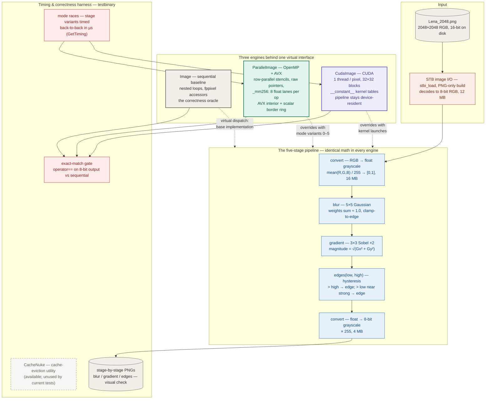
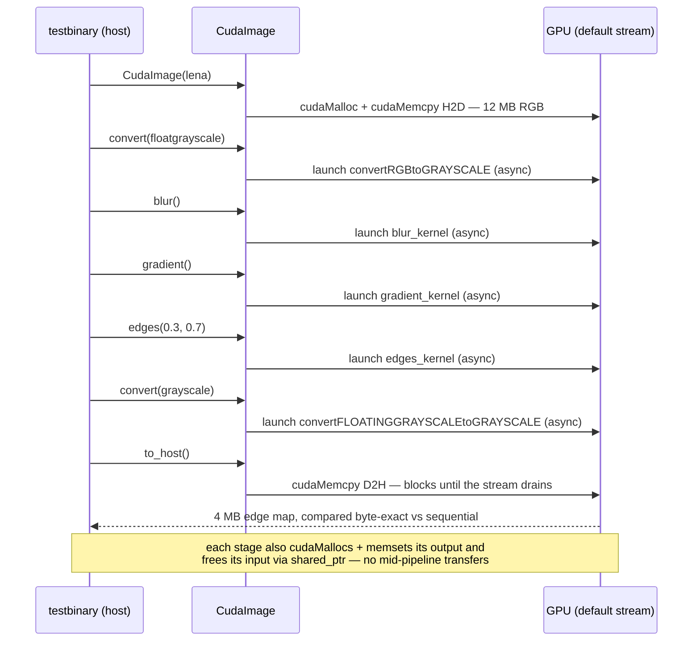

# Parallel Edge Detection — system design

> How a photograph becomes a line drawing, three ways.
>
> A PNG is flattened to floating-point grayscale, smoothed with a **5×5
> Gaussian**, differentiated with **Sobel** operators, and thresholded with
> **hysteresis** into a binary edge map. The same five stages run on three
> engines: a plain **sequential** loop nest (the correctness oracle), an
> **OpenMP + AVX** CPU engine that vectorizes the stencil interiors 8 pixels
> at a time, and a **CUDA** engine that gives every pixel its own GPU thread
> and never lets the data leave the device mid-pipeline. A GoogleTest harness
> races the variants and demands output byte-identical to the sequential
> engine's from all of them.

This document is the developer-facing map of the whole system — every
component and how data moves between them. The companion
[README](README.md) covers building, running, and per-engine detail.

---

## End-to-end flowchart



**Legend** — ⬜ data / sequential oracle · 🟧 I/O · 🟦 pipeline stages ·
🟩 OpenMP + AVX engine · 🟪 CUDA engine · 🟥 test harness ·
◌ dashed = present but unused.

---

## How to read it: the three ideas that matter

1. **One algorithm, three engines, one oracle.** The pipeline stages are
   virtual methods on `Image`; `ParallelImage` and `CudaImage` override them.
   The sequential implementation isn't legacy code — it's the *specification*.
   Every parallel path must reproduce its output **byte-for-byte** after
   quantization to 8-bit, which holds because every variant accumulates each
   pixel's stencil taps in the same order — keeping the CPU paths bit-identical
   — while the 8-bit quantization absorbs the low-order rounding differences
   the CUDA path can introduce (nvcc contracts multiply-adds to FMA by
   default). The exact-match gate turns subtle races and boundary bugs into
   hard test failures instead of slightly-wrong pictures.

2. **The pipeline is a `shared_ptr` chain, and that shape does real work.**
   `img->convert(...)->blur()->gradient()->edges(...)` frees each intermediate
   the moment the next stage is done with it. On the CUDA engine the same
   shape becomes a *residency* guarantee: each stage allocates its output on
   the device, so the whole pipeline is one host→device upload, five kernel
   launches, and one download at `to_host()` — zero intermediate transfers.

3. **Optimization is measured, not assumed.** Each stage carries numbered
   mode variants — naive OpenMP, accessor-free pointer indexing, flat
   single-loop, AVX — and the harness races them back-to-back per run and
   prints microsecond costs. The default mode of each stage is whichever
   variant won.
   The design lesson the numbers teach: parallelism (OpenMP) buys the first
   factor, *memory access discipline* (raw indexing, then 8-wide vector loads)
   buys the rest.

---

## Deep dive 1 — anatomy of a stencil, and the AVX split

Every stage except `convert` is a stencil: output pixel `(x, y)` is a
function of an input neighborhood (5×5 for blur, 3×3 for gradient and
hysteresis). Stencils near the border index outside the image, handled by
clamping coordinates to the nearest valid pixel (border replication).

That clamp is a branch — four comparisons per tap — and it poisons
vectorization. The AVX modes remove it structurally instead of predicating it:

```text
        ┌─────────────────────────────────────┐
        │  border ring — scalar pass, clamped │  pass 2: full clamping logic,
        │   ┌───────────────────────────────┐ │  `continue`-skips the interior
        │   │  interior — AVX pass          │ │
        │   │  margin = kernel radius       │ │  pass 1: per tap,
        │   │  (2 px blur, 1 px gradient)   │ │   broadcast weight (set1_ps)
        │   │  stencil cannot leave bounds  │ │   load 8 pixels  (loadu_ps)
        │   │  → zero branches in hot loop  │ │   multiply + accumulate
        │   └───────────────────────────────┘ │  then one 8-wide store
        └─────────────────────────────────────┘
```

Row-major layout makes the 8-wide load natural: 8 horizontally-consecutive
pixels are 8 consecutive floats. OpenMP parallelizes over rows (`y`), so
threads own disjoint bands and never contend on writes. A scalar remainder
loop finishes each row when the interior width isn't a multiple of 8, and the
two passes overlap on a one-pixel ring for the gradient — recomputing a few
identical values in exchange for simple bounds.

The CUDA kernels keep the clamp: with one thread per pixel there's no vector
lane to poison, and the uniform-stencil shape means adjacent threads read and
write adjacent addresses — coalesced by construction. Kernel coefficient
tables (`gaussian`, `xdir`, `ydir`) live in `__constant__` memory, which is
cached and broadcast-optimized for the case where every thread reads the same
value at the same time — exactly what a convolution does.

## Deep dive 2 — the CUDA pipeline, one upload to one download



Three consequences worth knowing:

- **The chain leans on `cudaFree`'s implicit synchronization.** Reassigning
  the `shared_ptr` frees the input buffer of a kernel that is still in
  flight; CUDA's blocking free waits for it, turning what would be a
  use-after-free into serialization.
- **Per-stage timings are muddied, not clean launch latencies.** Each timed
  stage includes the output's `cudaMalloc` + `cudaMemset`, the async launch,
  *and* the synchronizing free of the input — so it folds in roughly that
  stage's kernel execution plus memory-management overhead. The unambiguous
  figure is the pipeline total, ending at `to_host()`'s blocking copy.
- **The default stream serializes the stages** — each kernel sees its
  predecessor's completed output without explicit synchronization. Correct by
  construction, at the cost of no inter-stage overlap.

---

## Component inventory

| Component | Layer | Tech | Provenance | Where |
|---|---|---|---|---|
| `Image` base class + sequential stages | Oracle | C++20 | course scaffolding | [image.hpp](image.hpp) / [image.cpp](image.cpp) |
| STB integration (PNG-only) | I/O | C | third-party + scaffolding | [stb_instantiation.cpp](stb_instantiation.cpp) |
| `ParallelImage` mode variants | CPU engine | OpenMP + AVX intrinsics | ✅ implemented here | [parallel_image.hpp](parallel_image.hpp) |
| `CudaImage` + 5 kernels | GPU engine | CUDA | ✅ implemented here | [cuda_image.cu](cuda_image.cu) |
| Timing utilities (`GetTiming`, `CacheNuke`) | Harness | C++ / chrono | course scaffolding | [parallel_utils.cpp](parallel_utils.cpp) |
| Correctness + mode-race tests | Harness | GoogleTest | course scaffolding | [edgedetect_tests.cpp](edgedetect_tests.cpp) |
| CUDA pipeline test | Harness | GoogleTest | ✅ implemented here | [user_tests.cpp](user_tests.cpp) |
| Build (C++20, `-mavx`, CUDA 75/89, gtest FetchContent) | Build | CMake | course scaffolding | [CMakeLists.txt](CMakeLists.txt) |
| `edgedetect` CLI | — | — | ⬜ stub only ("Hello world!") | [main.cpp](main.cpp) |

---

## The numbers that matter

| Value | What it is |
|---|---|
| 5×5 = 25 taps | Gaussian blur kernel (weights sum ≈ 1.0) |
| 3×3 ×2 = 18 taps | Sobel X + Y convolutions per gradient pixel |
| 0.3 / 0.7 | weak / strong hysteresis thresholds used by the tests |
| 8 | float lanes per 256-bit AVX register — pixels per vector op |
| 2 px / 1 px | interior margin for the AVX blur / gradient passes |
| 32×32 = 1024 | threads per CUDA block; grid is (width/32, height/32) |
| 7.5, 8.9 | CUDA compute capabilities compiled for (Turing, Ada) |
| 2048×2048 | test image — 12 MB as RGB, 16 MB as float grayscale, 4 MB as 8-bit output |
| 1 + 1 | host↔device transfers for the whole GPU pipeline (upload + download) |
| /(255·3) | RGB→gray mapping: equal-weight channel mean into [0,1] |
| 6 / 5 / 4 / 3 | implementation variants per stage: convert / blur / gradient / edges — all raced except the AVX gradient, which runs only via default dispatch |
| µs | timing resolution (`GetTiming`, std::chrono) |
| 0 | tolerated output difference — parallel results must match the oracle byte-for-byte (8-bit, channel 0) |

---

## Verification workflow

| Stage | Test | What it proves |
|---|---|---|
| 1 | `ImageTest.*` | I/O round-trips, shrink vs reference PNG, convert round-trip, sequential pipeline produces the expected stage PNGs |
| 2 | `ParallelTest.TimeCopy / TimeConvert / TimeBlur / TimeGradient / TimeEdge` | the OpenMP/AVX mode races: each variant timed and byte-identical to the sequential oracle — except the AVX gradient (mode 3), covered only indirectly via default dispatch in `TimeEdge` / `FullPerformance` |
| 3 | `ParallelTest.FullPerformance` | whole-pipeline sequential vs parallel race; prints speedup + thread count |
| 4 | `TestCudaImage.TestEach` | full GPU pipeline with per-stage timings; final output byte-identical to the oracle |
| 5 | visual | stage PNGs (`Lena_blurred/gradient/edges.png`) written to the build dir for eyeball verification |

---

## Design trade-offs & sharp edges

- **Exact-match testing over tolerance testing** — brutal but unambiguous;
  it forces every variant to keep the same accumulation order, which rules
  out reduction-reordering optimizations but makes "correct" binary. (One
  blind spot: `operator==` compares only channel 0 — complete for the
  single-channel pipeline outputs, but the RGB copy race effectively checks
  just the red channel.)
- **Grid truncation** — CUDA grids use integer division (`width/32`), so
  non-multiple-of-32 images would leave a black remainder strip. The kernels
  already carry per-thread bounds guards; ceil-division in the grid
  computation is the only missing piece.
- **Fallback traps** — `CudaImage`'s unsupported conversions fall through to
  base-class CPU code that would touch a device pointer; the supported path
  (`rgb→floatgrayscale`, `floatgrayscale→grayscale`, mode 0) is the only safe
  one. On the CPU side, an out-of-range `ParallelImage` mode returns an
  allocated but never-written image for the stencil stages, and
  `ParallelImage::to_host()` throws rather than inheriting the base no-op.
- **Not full Canny** — no non-maximum suppression (edges are thick) and
  single-pass hysteresis (no iterative edge tracking). The pipeline optimizes
  for comparable parallel workloads, not publication-grade edge maps.
- **Warm-cache timings** — the mode races run back-to-back on the same image;
  `CacheNuke` exists to fix that but isn't wired into the current tests.

---

## Provenance

Course-provided scaffolding (image framework, oracle implementation, test and
build harness) with the parallel engines implemented on top: the OpenMP + AVX
mode system in `parallel_image.hpp` and the CUDA engine in `cuda_image.cu` /
`user_tests.cpp`. Image I/O via [STB](https://github.com/nothings/stb); test
image is the [ethically sourced Lena recreation](https://mortenhannemose.github.io/lena/)
by Morten Rieger Hannemose; tests via GoogleTest.
